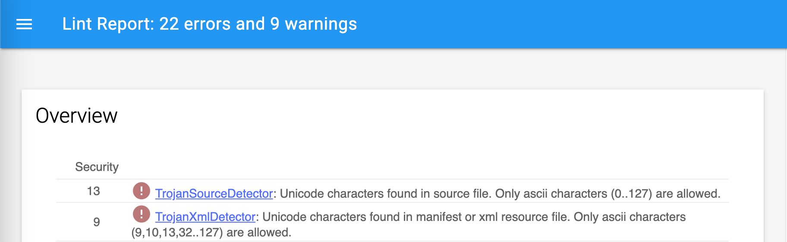

[](https://jitpack.io/#BottleRocketStudios/Android-CustomLintRules)
# CustomLintRules
## What this library does?
This library currently provides the following lint rules that detect unsupported characters in source and xml files:

 * `TrojanSourceDetector` - covers Java and Kotlin files
 * `TrojanXmlDetector` - covers XML resource and Android manifest files

A fatal lint error will be reported if any unicode (or unsupported ascii) characters are detected. Only printable(`32..126`) + horizontal tab/line feed/carriage return(`9`, `10`, `13`) ascii characters are allowed.

## Usage
1. Add jitpack in your root build gradle **at the end of `allprojects.repositories`**. *[Jitpack recommends](https://docs.jitpack.io/) adding to the end as Gradle will go through all repositories in order until it finds a dependency and jitpack likely accounts for a small portion of dependencies in your project*:

```kotlin
allprojects {
    repositories {
        // ...
        maven(url = "https://jitpack.io")
    }
}
```

2. Add the following to all your module build gradle files where you want to use the lint rules:

```kotlin
dependencies {
    // ...
    implementation("com.github.BottleRocketStudios:Android-CustomLintRules:1.0.0")
    // ...
}
```

3. Perform a gradle sync and run the `lint` gradle task (`gradlew lint`). Any problems detected by the custom lint rules will be shown in the generated lint report.

## Sample characters that will cause a lint error 
* BIDI symbols: `LRE`, `RLE`, `LRO`, `RLO`, `LRI`, `RLI`, `FSI`, `PDF`, `PDI` (some of the actual symbols ⁦⁧⁩‮)
    * See https://trojansource.codes/trojan-source.pdf for more details
* Homoglyphs such as Н ([cyrillic en](https://en.wikipedia.org/wiki/En_(Cyrillic)))
* Symbols such as € or 👍
* Ascii control characters: `0..31` and `127`

## Sample Lint Reports
### View of the html lint report (generated via `gradlew lint` on your project)


### Sample `TrojanSource` Lint Failure


### Sample `TrojanXml ` Lint Failure


## Details of the attack
* https://www.theregister.com/2021/11/01/trojan_source_language_reversal_unicode/
* https://nvd.nist.gov/vuln/detail/CVE-2021-42574
* https://trojansource.codes/
* https://github.com/nickboucher/trojan-source

## Additional Links
* https://www.w3schools.com/charsets/ref_html_ascii.asp - ascii ranges

## Build
### Project structure
* [`sample`](sample) - Sample project containing source code and xml that will trigger the custom lint rules.
* [`library`](library) - Android library project that packages up the `lintRules` into the library aar.
* [`lintRules`](lintRules) - actual source of the lint rules (with tests).

### General
* View root of jitpack generated data for this project at https://jitpack.io/com/github/BottleRocketStudios/Android-CustomLintRules/
    * Copy-paste additional values from page responses to the url path to traverse down the tree of all files managed by jitpack for your builds and view/retrieve things like log files, module files, pom files, and aars.

### jitpack development/SNAPSHOT builds
Access development/SNAPSHOT builds by replacing the version with an arbitrary `release tag`, `commit hash`, or `branch~name-SNAPSHOT` (ex: `develop-SNAPSHOT`, `feature~abc-SNAPSHOT`). You can also browse https://jitpack.io/#BottleRocketStudios/Android-CustomLintRules to generate a dependency value from a list of all jitpack builds.

### Local aar generation
* You can generate a locally built aar for testing by executing the `publishReleasePublicationToMavenLocal` Run Configuration.
* Quickly navigate to the output by executing the `Open Local Maven Publication Folder` Run Configuration.